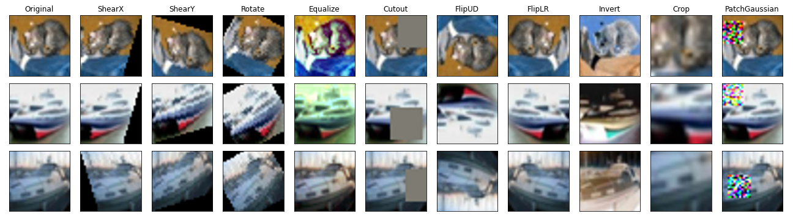

# Data Augmentation

## Dynamic Augmentation

Unless specified otherwise, data augmentation was applied following standard practice: each time
an image is drawn, the given augmentation is applied with a given probability. We call this mode
dynamic augmentation. Due to whatever stochasticity is in the transform itself (such as randomly
selecting the location for a crop) or in the policy (such as applying a flip only with 50% probability),
the augmented image could be different each time. Thus, most of the tested augmentations increase
the number of possible distinct images that can be shown during training

## Affinity and Diversity

## Example

